# pesquisa_campo_de_dados

<<<<<<< HEAD
##Tecnologias
=======
## Tecnologias:

>>>>>>> cfc47aaf29fd64a2ca276c420452fbe72fe61e84
Node.sj
JavaScript
VsCode
VsCode Thunder Client

##Passos para testar:

<<<<<<< HEAD
 1-Clone este repositório
=======
1-Clone este repositório
>>>>>>> cfc47aaf29fd64a2ca276c420452fbe72fe61e84

2-Abra com VsCode e em um terminal digite:

npm install
npm run dev

3-ste as rotas com a extensão Thunder Client do VsCode

4-Abra o arquivo client/index.html com a extensão Live Server do VsCode

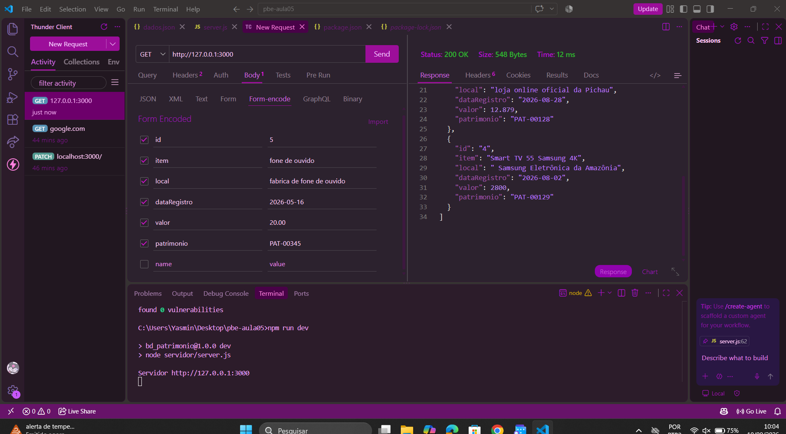

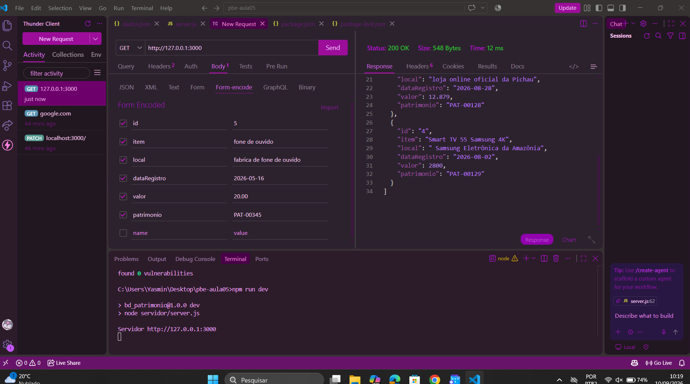

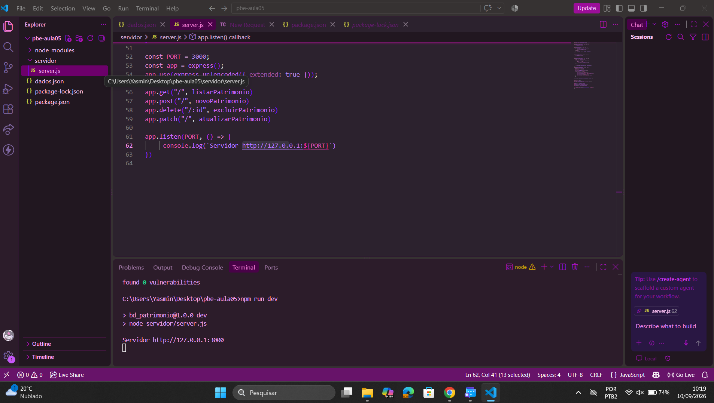

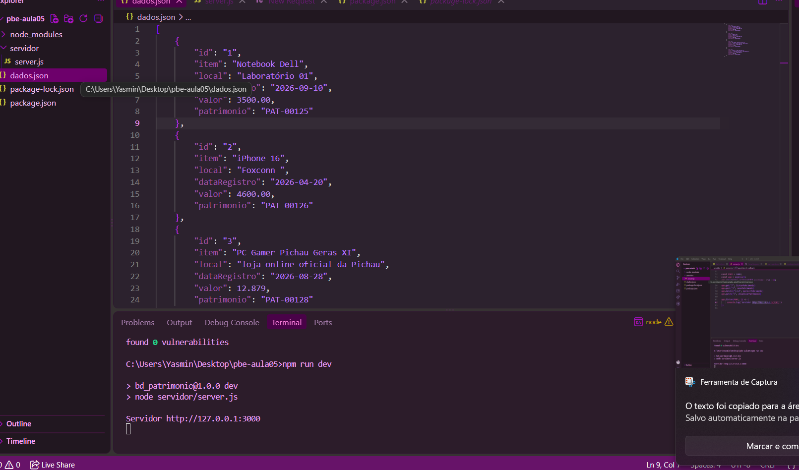

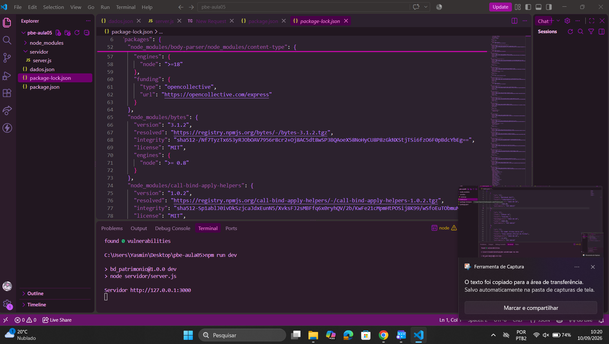

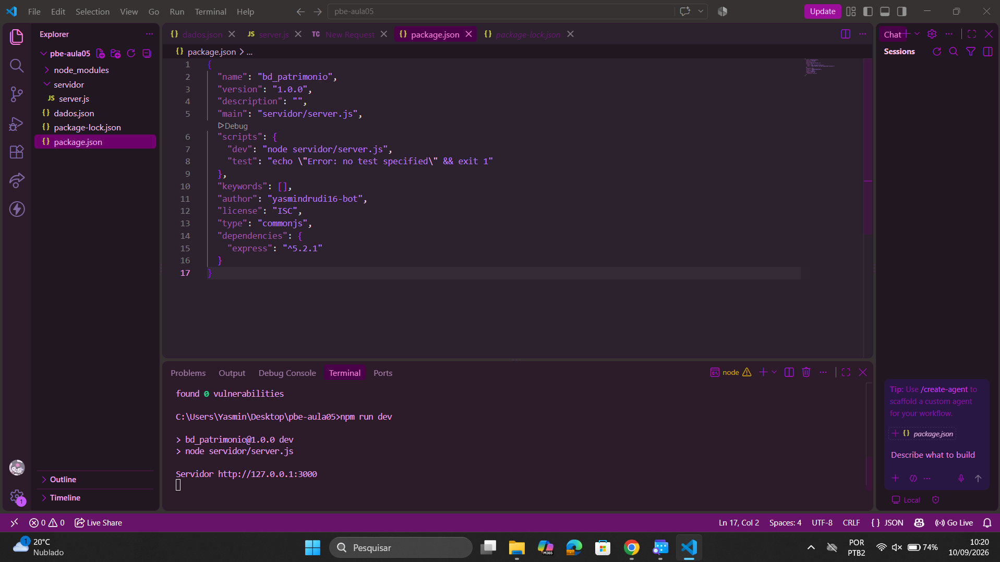

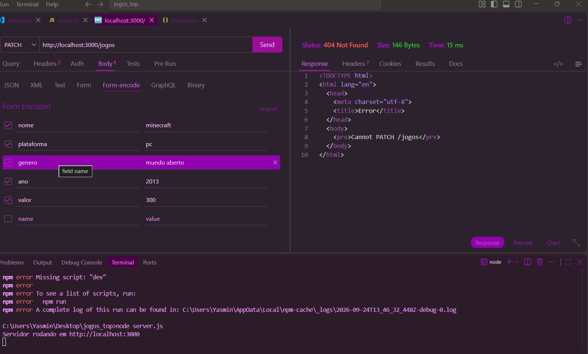

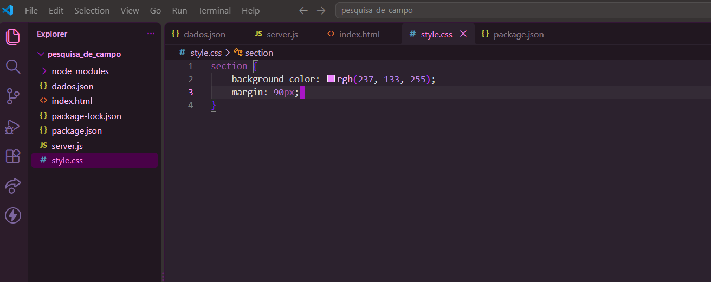

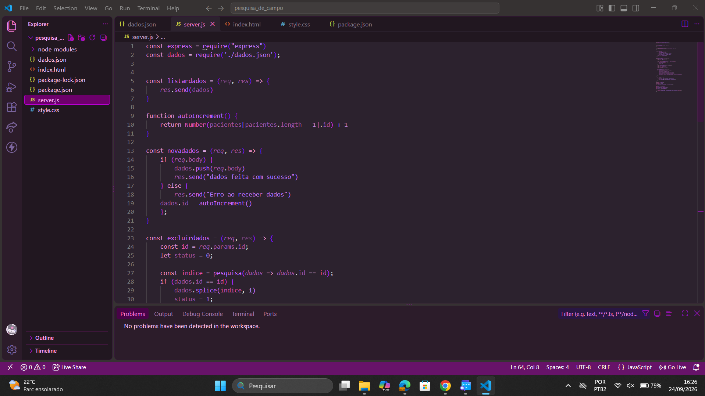

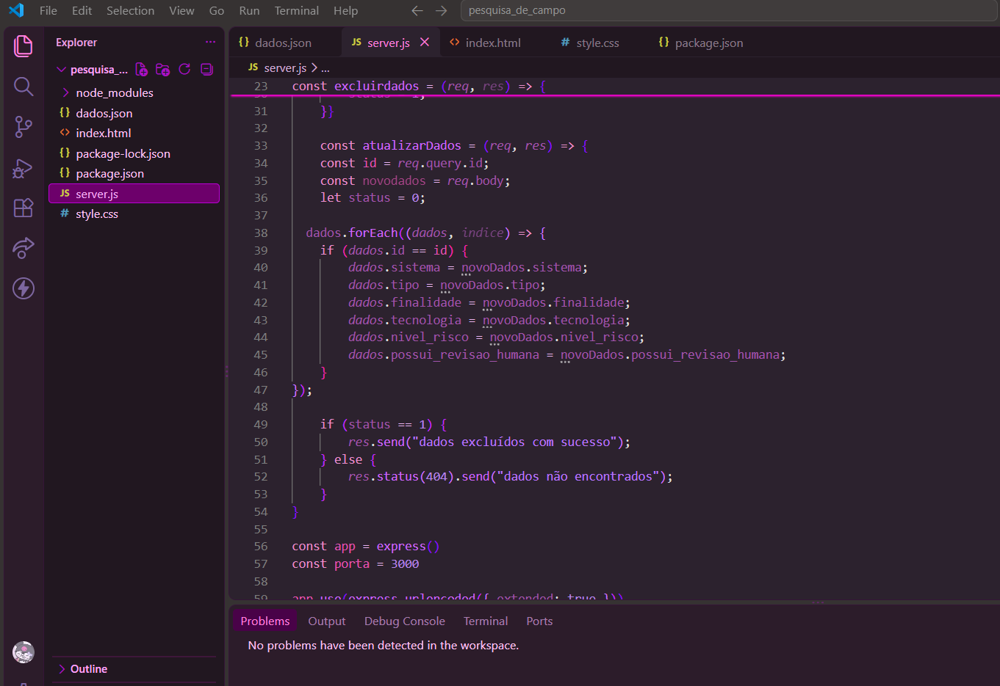

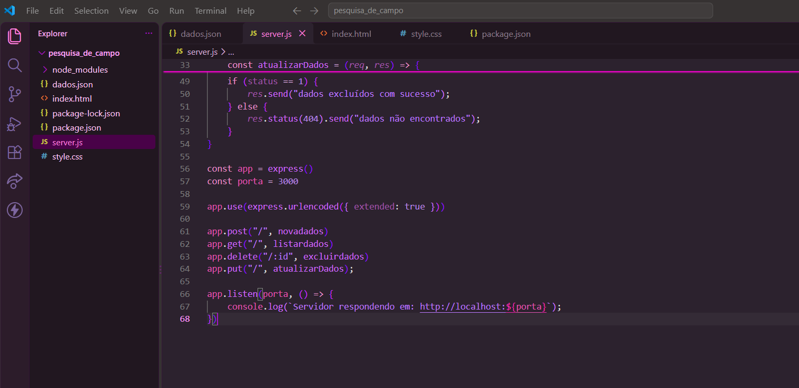

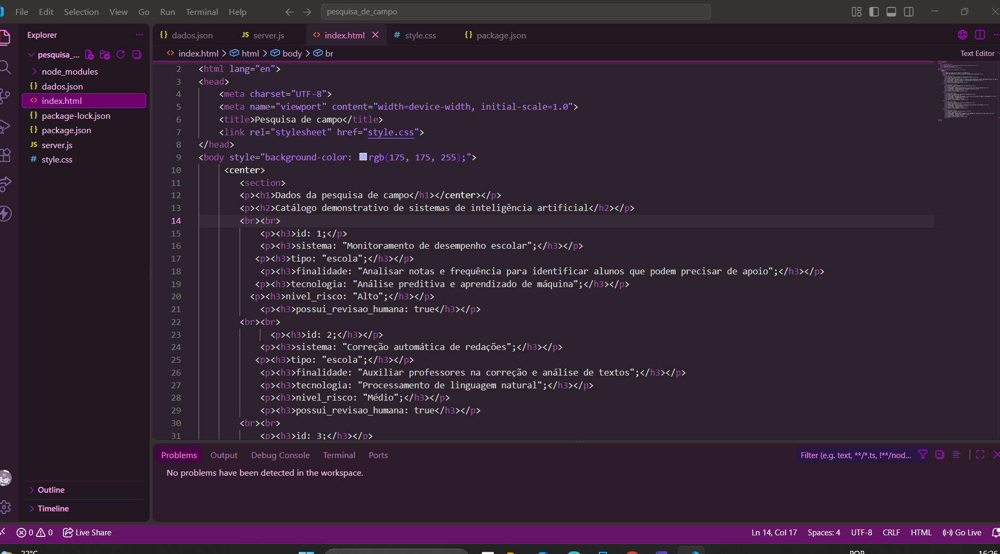

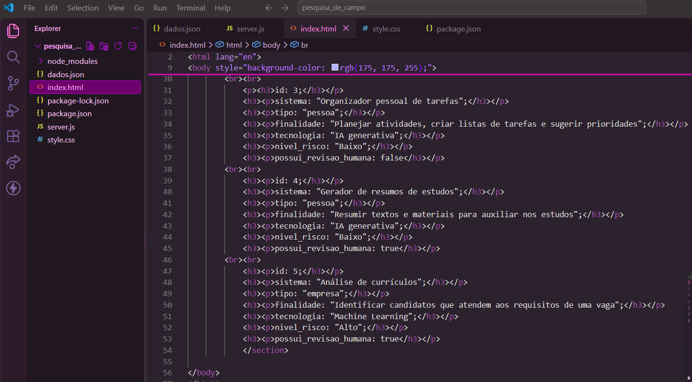

<<<<<<< HEAD
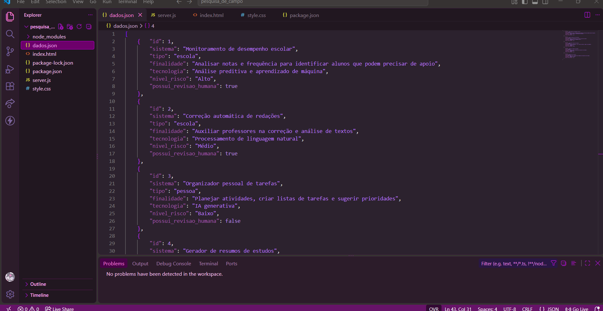
=======

>>>>>>> cfc47aaf29fd64a2ca276c420452fbe72fe61e84
